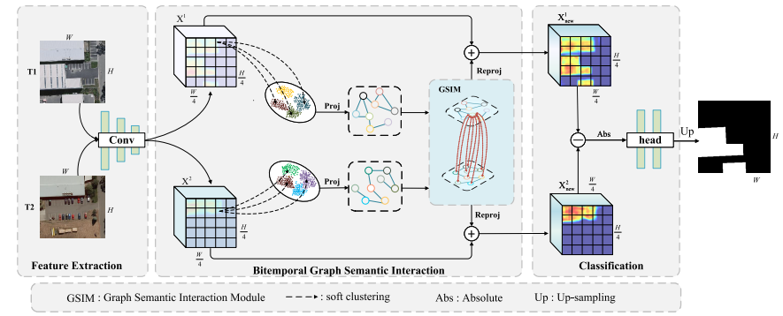
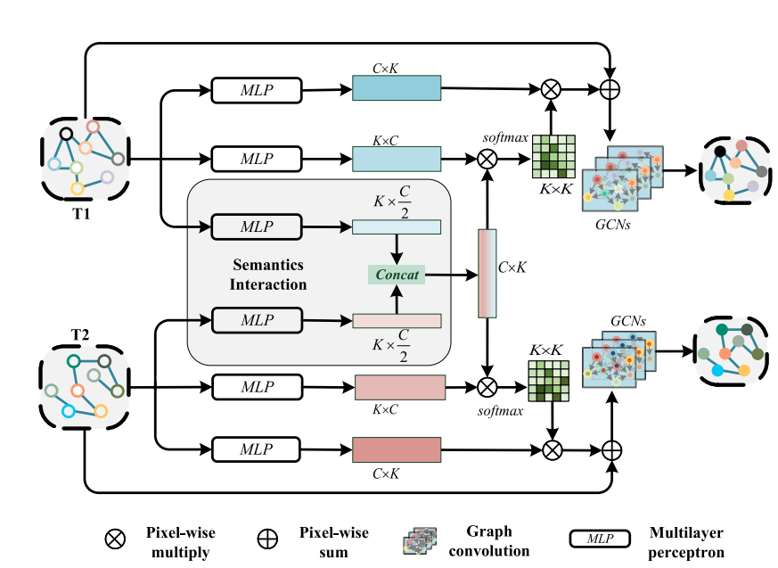

# [BGSINet-CD: Bitemporal Graph Semantic Interaction Network for Remote-Sensing Image Change Detection](https://ieeexplore.ieee.org/document/10458994)

**Authors:** [Binge Cui](https://ieeexplore.ieee.org/author/37086379809), [Chenglong Liu](https://ieeexplore.ieee.org/author/37088488229), [Jianzhi Yu](https://ieeexplore.ieee.org/author/37088352219)

Here, we provide the pytorch implementation of the paper: BGSINet-CD: Bitemporal Graph Semantic Interaction Network for Remote-Sensing Image Change Detection For more ore information, please see our published paper at [arxiv](https://arxiv.org/abs/2307.02007). 

# 🛎️Updates

**🎉 Exciting News! 🎉**
Mar. 04th, 2024，We are thrilled to announce that **BGSINet** has been accepted for publication in **IEEE GRSL**! 🎉 You can check it out [here](https://ieeexplore.ieee.org/document/10458994).

If you find the project interesting, please consider giving it a ⭐️ **star** ⭐️ to support us! Stay tuned for more updates! 🔥

## 🔭Overview



## 🌟Graph Semantics Interaction Module (GSIM)



## **📝** Requirements

To run this project, you need to install the following dependencies:

```
albumentations>=1.3.0
numpy>=1.20.2
opencv_python>=4.7.0.72
opencv_python_headless>=4.7.0.72
Pillow>=9.4.0
Pillow>=9.5.0
scikit_learn>=1.0.2
torch>=1.9.0
torchvision>=0.10.0
```


## 🛠️ **Installation**

To clone this repository and get started, use the following commands:

```shell
git clone https://github.com/JackLiu-97/BSINet.git
cd BSINet
```


------

## 🗝️ **Quick Start**

### **1. Download Pretrained Models**

You can download our **BSINet pretrained models** from the following links:

- **WHU-CD**: [Baidu Drive (code: itrs)](https://pan.baidu.com/s/1hgrOeRWs_cw_GuUL2KncvA?pwd=itrs)
- **GZ-CD**: [Baidu Drive (code: itrs)](https://pan.baidu.com/s/13SiakvM9p3XwgFwW9Zilag?pwd=ITRS)

After downloading the pretrained model, place it in the `output` directory.

------

### **2. Run the Demo**

Once you have placed the pretrained model in the `output` folder, you can run a demo to get started. Use the following command:

```bash
python demo.py --ckpt_url ${model_path} --data_path ${sample_data_path} --out_path ${save_path}
```

- Replace `${model_path}` with the path to your downloaded pretrained model.
- Replace `${sample_data_path}` with the path to your sample data.
- Replace `${save_path}` with the directory where you want to save the prediction results.

------

### **3. Check the Results**

After running the demo, you can find the prediction results saved in the `${save_path}` directory.


## 🚀 **Training**

To evaluate a model on the test subset, use:

```shell
python train.py --data_path ${train_data_path} --val_path ${val_data_path} --lr ${lr} --batch_size ${-batch_size} 
```


## 🔍 **Evaluation**

To evaluate a model on the test subset, use

```shell
python test.py --ckpt_url ${model_path} --data_path ${test_data_path}
```


- ## 📚 **Supported Datasets**

  ### **1. WHU Building Change Detection Dataset**

  - **Description**:
    The dataset consists of two aerial images taken at different time phases, covering the exact location and containing **12,796 buildings** within a **20.5 km²** area.

  - **Resolution**: **0.2 m** per pixel.

  - **Image Size**: **32,570 × 15,354** pixels.

  - Preprocessing:

    We crop the images to a 256 × 256 size and randomly split them into training, validation, and test sets with the following distribution:

    - **Training**: 6,096 images
    - **Validation**: 762 images
    - **Test**: 762 images

  ------

  ### **2. Guangzhou Dataset (GZ-CD)**

  - **Description**:
    Collected from **2006 to 2019**, this dataset covers the suburbs of **Guangzhou, China**. To facilitate the generation of image pairs, the Google Earth service in BIGEMAP software was used.
    The dataset contains **19 seasonally varying VHR image pairs**.
  - **Resolution**: **0.55 m** per pixel.
  - **Image Size**: Ranges from **1,006 × 1,168** pixels to **4,936 × 5,224** pixels.
  - Preprocessing: We crop the images to a 256 × 256size and randomly divide them into training, validation, and test sets with the following distribution:
    - **Training**: 2,876 images
    - **Validation**: 353 images
    - **Test**: 374 images

|                 Dataset                 | Name  |                             Link                             |
| :-------------------------------------: | :---: | :----------------------------------------------------------: |
| GZ-CD building change detection dataset | `GZ`  | [website](https://github.com/daifeng2016/Change-Detection-Dataset-for-High-Resolution-Satellite-Imagery) |
|  WHU building change detection dataset  | `WHU` | [website](http://study.rsgis.whu.edu.cn/pages/download/building_dataset.html) |


## 📄 **License**

The code is released for **non-commercial** and **research purposes only**. For commercial use, please contact the authors.
