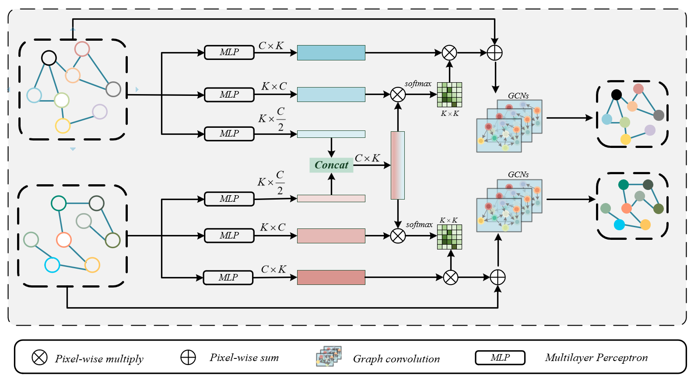

# BSINet-CD: Bitemporal Semantics Interaction Network for Remote Sensing Images Change Detection

Here, we provide the pytorch implementation of the paper: Remote Sensing Image Change Detection with Graph Interaction

For more ore information, please see our published paper at [arxiv](https://arxiv.org/abs/2307.02007). 

## Overall Architecture


## Semantics Interaction Module (SIM)



## Requirements

```
albumentations>=1.3.0
numpy>=1.20.2
opencv_python>=4.7.0.72
opencv_python_headless>=4.7.0.72
Pillow>=9.4.0
Pillow>=9.5.0
scikit_learn>=1.0.2
torch>=1.9.0
torchvision>=0.10.0
```


## Installation

Clone this repo:

```shell
git clone https://github.com/JackLiu-97/BSINet.git
cd BSINet
```


## Quick Start

Firstly, you can download our BSINet pretrained model

WHU-CD： [baidu drive, code: afse](https://pan.baidu.com/s/1FzfAzJK0_p159nT7p4x45A) . 

GZ-CD： [baidu drive, code: afse](https://pan.baidu.com/s/1SgH2oJ64uBnJBLv90pixPA) . 

After downloaded the pretrained model, you can put it in `output`.

Then, run a demo to get started as follows:

```shell
python demo.py --ckpt_url ${model_path} --data_path ${sample_data_path} --out_path ${save_path}
```

After that, you can find the prediction results in `${save_path}`.


## Train

To train a model from scratch, use

```shell
python train.py --data_path ${train_data_path} --val_path ${val_data_path} --lr ${lr} --batch_size ${-batch_size} 
```


## Evaluate

To evaluate a model on the test subset, use

```shell
python test.py --ckpt_url ${model_path} --data_path ${test_data_path}
```


## Supported Datasets

- The WHU Building Change Detection Dataset :The dataconsists of two aerial images of two different time phases and the exact location, which contains $12796$ buildings in $20.5km^2$ with a resolution of $0.2 m$ and a size of $32570\times15354$.We crop the images to $256\times256$ size and randomly divide the training, validation, and test sets:$ 6096/762/762$. 

- Guangzhou Dataset(GZ-CD) : The dataset was collectedfrom $2006-2019$, covering the suburbs of Guangzhou, China, and to facilitate the generation of image pairs, the Google Earth service of BIGEMAP software was used to collect 19 seasonally varying VHR image pairs with a spatial resolution of$ 0.55 m$ and a size range of $1006\times1168$ pixels to $4936\times5224$.We crop the images to $256\times 256$ size and randomly divide the training, validation, and test sets:$ 2876/353/374$

|                 Dataset                 | Name  |                             Link                             |
| :-------------------------------------: | :---: | :----------------------------------------------------------: |
| GZ-CD building change detection dataset | `GZ`  | [website](https://github.com/daifeng2016/Change-Detection-Dataset-for-High-Resolution-Satellite-Imagery) |
|  WHU building change detection dataset  | `WHU` | [website](http://study.rsgis.whu.edu.cn/pages/download/building_dataset.html) |


## License

Code is released for non-commercial and research purposes **only**. For commercial purposes, please contact the authors.
